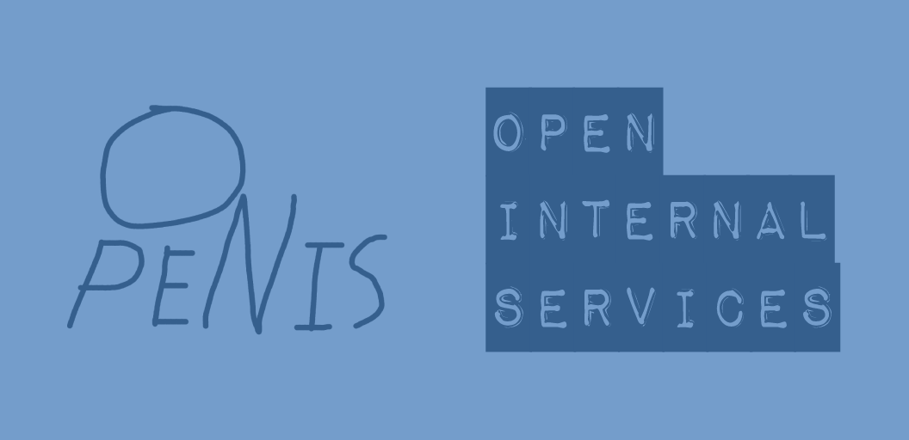
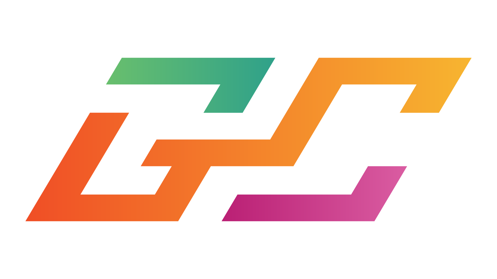

# OpenIS

[English](README.md) | [Thai](README-TH.md)

Open Internal Services for Discord servers

## What is OpenIS?

OpenIS is ~~the best Discord bot <abbr title="First working open source Discord bot">in Thailand</abbr>. If you want to grab some codes and put them in your proprietary project then go ahead, this project is [MIT License](#license)'d, and don't forget to put the copyright notice if you are distributing this project~~ **AN OPEN SOURCE ANARCHY DISCORD BOT**

## Add bot to a server

Use this [permissions calculator](https://discordapi.com/permissions.html) to add bot with specific permissions. Use `880996949933838356` as "Client ID"

Or [click here](https://discord.com/api/oauth2/authorize?client_id=880996949933838356&permissions=8&scope=bot%20applications.commands) for full permissions

## How to contribute

Thank you for considering contributing to this project. I, as the project owner, didn't expected anyone in Thailand will give ~~a fuck~~ an attention in contributing to it at all. But if you do, please check [CONTRIBUTE.md](CONTRIBUTE.md). I'd appreciate it

## FAQs

#### Q: Am I allowed to copy the codes?

Yes, as long as you have copyright notice if you are distributing this project

#### Q: I do not publish my distributed version of this project. Do I still have to put copyright notice

You are not required to do that, but please put some credits

#### Q: Is there a Discord server for this project?

We do not have a Discord server at this time

#### Q: Why `yarn` instead of `npm`?

`npm` is rigged by [GitHub](https://github.com/) and [GitHub](https://github.com/) is rigged my [Microsoft](https://www.microsoft.com/). `yarn` on the other hand.. wait.. `yarn` was rigged by [Facebook](https://facebook.com) lol

#### Q: I do not use JavaScript. How do I run the bot?

Switch to JavaScript

#### Q: Why OpenIS?

Dick

#### Q: Is this supposed to be a meme?

Exactly, but if you want to use this project in your organization then may your organization become a meme

## Sponsor

The hosting server is provided by [Gcies](https://gcies.net/)

[

](https://gcies.net/)

## License

See [LICENSE.md](LICENSE.md) (MIT License)
